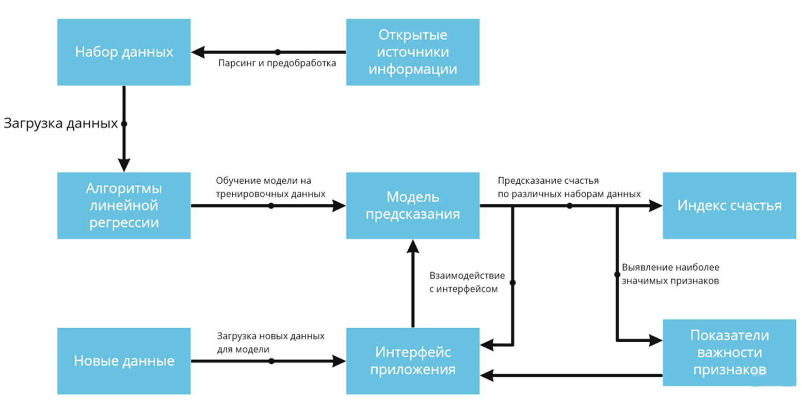
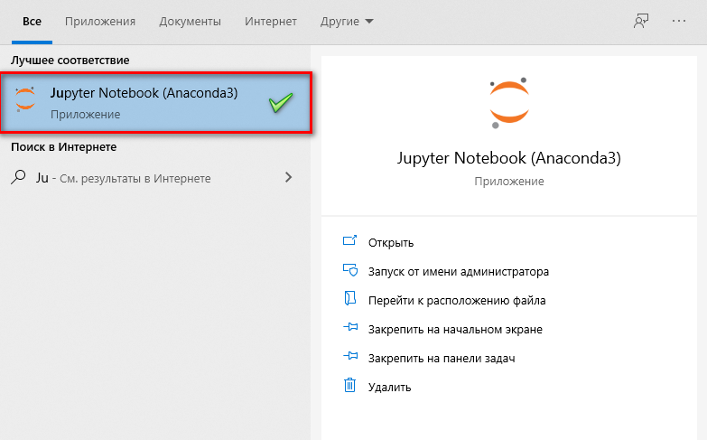
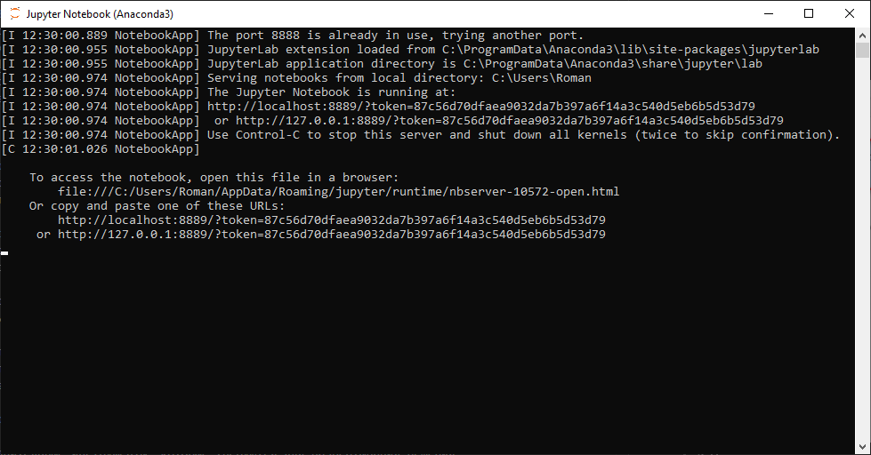
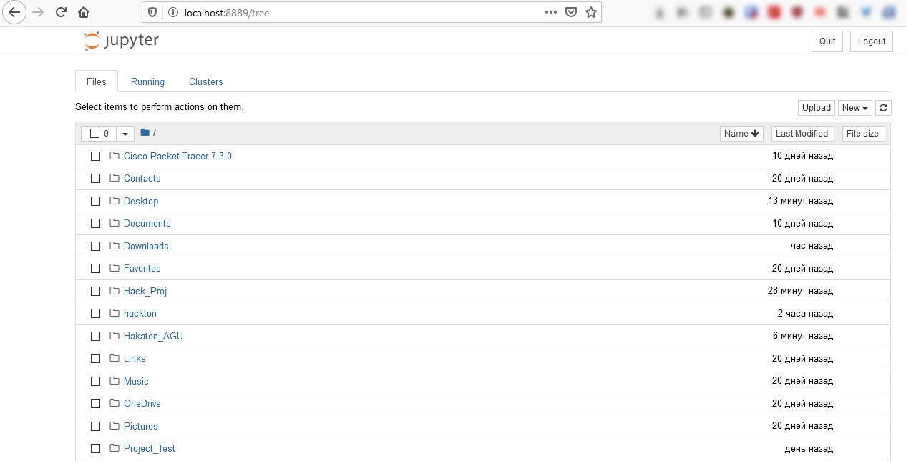
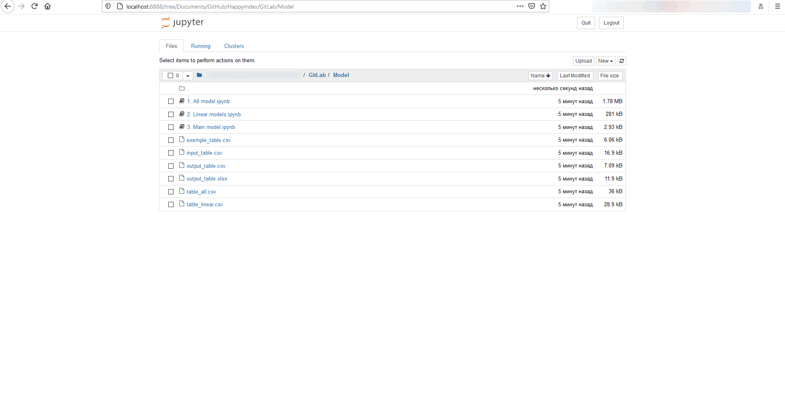
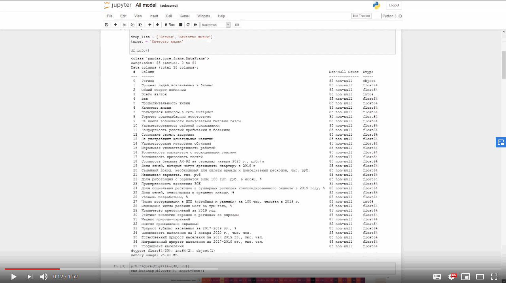

# Общее описание решения

Проект является цифровым решением в рамках конкурса World AI&DATA Challenge, соответствующиим задаче "Качественное изменение взаимодействия государства и человека (индекс счастья)" [Ссылка на задачу](https://datamasters.ru/task?id=3)

## Общее описание логики работы решения

## Требования к окружению для запуска продукта
Платформа: кроссплатформенное решение, требуется интепретатор Python.

Язык программирования : Python, версия 3.7.6

## Сценарий сборки и запуска проекта
Для запуска необходима среда Anaconda + Jupyter

Установка окружения [Инструкция для Windows 10](https://pythonru.com/baza-znanij/kak-ustanovit-anaconda-na-windows)

### Запуск проекта в Jupyter
1. После установки Anaconda, в меню пуск появится Jupyter Notebook (Anaconda), ее необходимо запустить. 
2. После запуска у вас откроется консоль с Jupyter и вас перенаправит в ваш браузер по умолчанию, в котором откроется web-интерфейс Jupyter Notebook.  
3. Далее перейти в папку где лежит проект, далее папка Model в которой будут находится все три файла с моделями 

## Примеры использования
В нашем решении, пока представлено графическое отображение информации с помощью Jupyter Notebook.

### Видео о проекте

## Используемые наборы данных
Для решения задачи мы в команде использовали, набор данных из различных источников, все данные представленны в папке raw data.
## Дополнительный инструментарий
Не требуется.