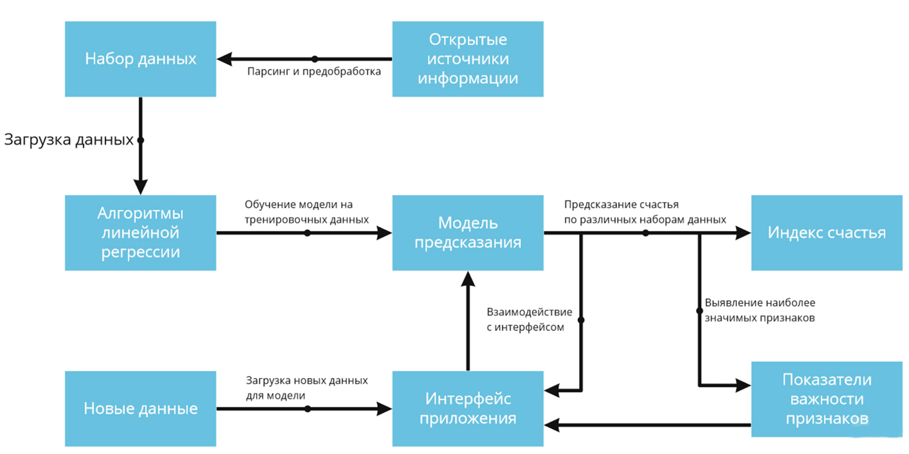
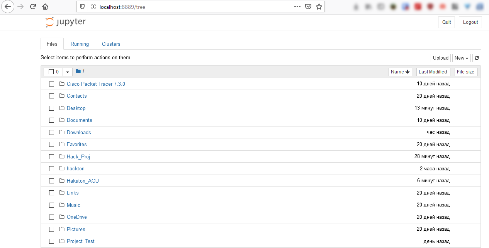
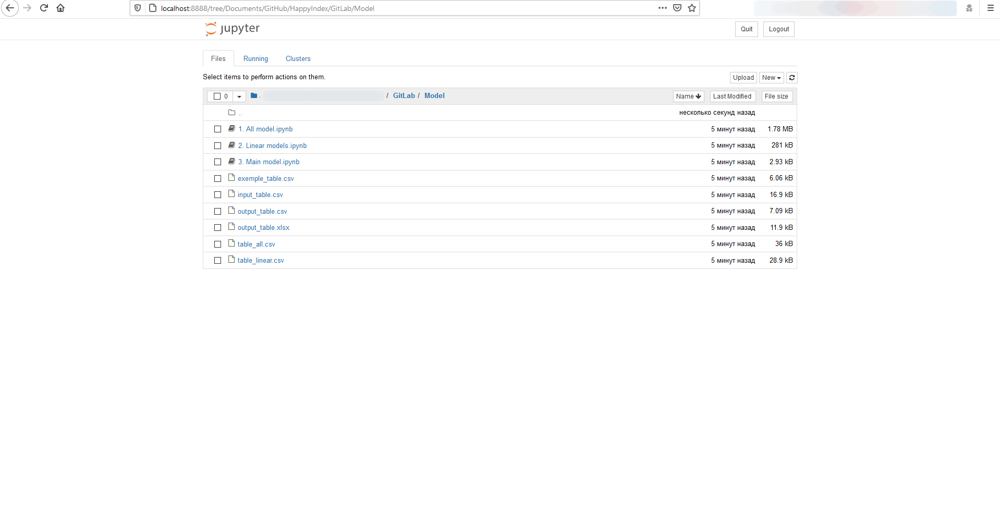
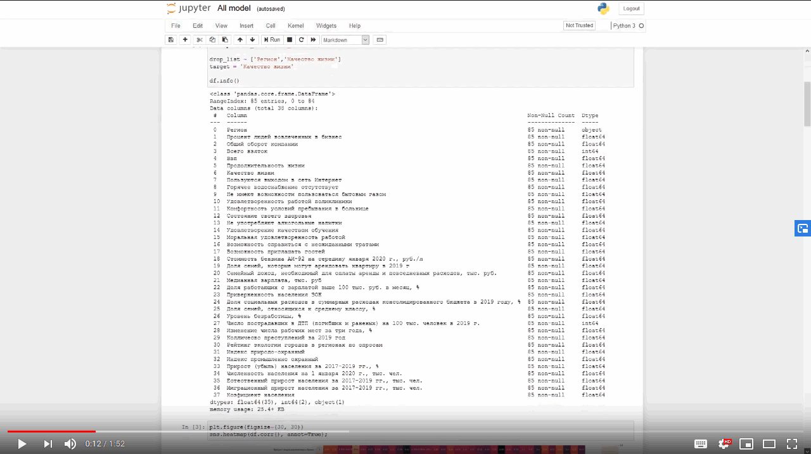

# General description of the solution

The project is a digital solution for the competition World AI&DATA Challenge, by task "Qualitative change in the interaction between the state and the person (index of happiness)". [Task link](https://datamasters.ru/task?id=3)

## General description of the logic of the solution

## Environment requirements
Platform: Cross-platform solution, requires a Python interpreter.

Programming language: Python, version 3.7.6.

## Project build and run script
Anaconda + Jupyter environment is required to run.

Setting up the environment [Instructions for Windows 10](https://pythonru.com/baza-znanij/kak-ustanovit-anaconda-na-windows)

### Running a project in Jupyter
1. After installing Anaconda, Jupyter Notebook (Anaconda) will appear in the start menu, it needs to be started. 
2. Once launched, a Jupyter console will open and you will be redirected to your default browser, which will open the Jupyter Notebook web interface.  
3. Next, go to the folder where the project is located, then the Model folder in which all three files with models will be located.

## Examples of using
In our solution, a graphical display of information is presented using Jupyter Notebook.

### Video of the project

## Used datasets
To solve the problem, we in the team used a set of data from various sources, all data is presented in the raw data folder.
## Additional tools
Not required.